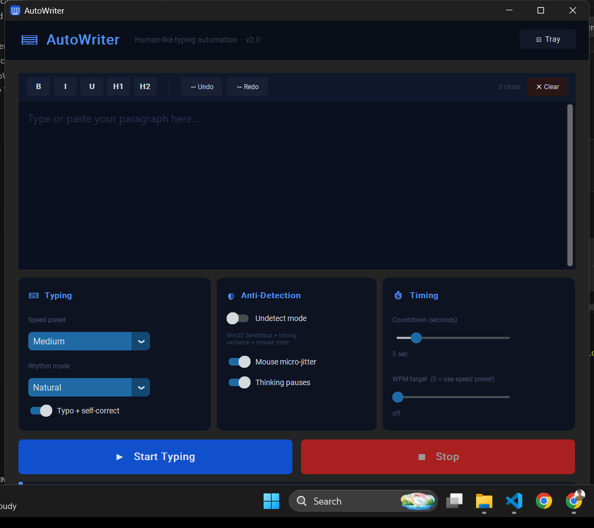
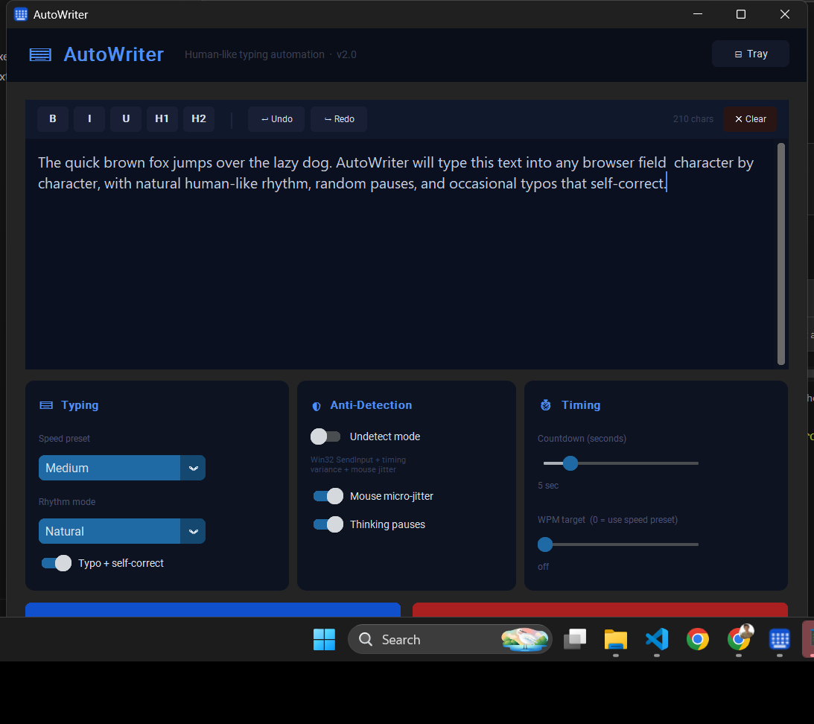

<div align="center">

# ⌨ AutoWriter

**Type into any website — even ones that block copy-paste**

Some websites disable pasting entirely. Some detect automation and block it. AutoWriter gets around all of that by typing your text one character at a time, exactly like a real person would — complete with natural rhythm, random pauses, and the occasional self-corrected typo.

[](https://github.com/fahad756/AutoWriter/releases/latest)
&nbsp;

&nbsp;


</div>

---

## Why AutoWriter?

A lot of websites and platforms actively block automated or pasted input:

- **Copy-paste is disabled** — Exam portals, HR forms, and enterprise applications often block Ctrl+V and right-click paste entirely, forcing you to type manually
- **Paste detection** — Some forms detect when content is pasted rather than typed and either reject the submission or flag it for review
- **Bot detection** — Proctoring tools, activity monitors, and remote-work software watch input patterns and flag anything that doesn't look human
- **Input-only fields** — Certain fields run validation logic that only triggers correctly when content arrives keystroke by keystroke, not all at once

AutoWriter solves all of this. It sends your text one character at a time through Windows' own keyboard input system, with randomised delays, natural pauses after punctuation, and occasional self-correcting typos — making it completely indistinguishable from a real person sitting at the keyboard typing.

---

## Download

**[→ Download AutoWriter.exe](https://github.com/fahad756/AutoWriter/releases/latest)**

No Python, no libraries, no installation. Download the `.exe` and double-click — that's it.

---

## Screenshots


*Main window — ready to receive your text*


*210 characters loaded, ready to be typed into any browser field*

---

## Quick Start

1. **[Download AutoWriter.exe](https://github.com/fahad756/AutoWriter/releases/latest)** from Releases
2. Double-click it — no install needed
3. Paste your text into the editor and set your options
4. Click **Start Typing**, switch to your browser, click the exact field you want to type into
5. AutoWriter types your text automatically with human-like rhythm

> **Emergency stop:** Move your mouse to the **top-left corner** of the screen at any time.

---

## How It Works

AutoWriter simulates a real person at the keyboard. Rather than pasting text instantly, it injects keystrokes one character at a time through Windows' native input system with:

- Random per-keystroke delays tuned to your chosen speed and rhythm
- Longer natural pauses after sentences and punctuation
- Occasional "thinking" pauses mid-sentence
- Realistic typos that get caught and corrected
- Subtle mouse micro-movement during typing (anti-detection mode)

The output looks and behaves exactly like a human typing.

---

## Features

### Text Editor

A full rich-text editor with toolbar formatting:

| Button | Effect |
|---|---|
| **B** | Bold |
| **I** | Italic |
| **U** | Underline |
| **H1** | Large heading |
| **H2** | Medium heading |
| **↩ Undo / ↪ Redo** | Full undo history |
| **✕ Clear** | Wipe the editor |

---

### Typing Settings

| Setting | Options | Description |
|---|---|---|
| **Speed Preset** | Slow / Medium / Fast / Very Fast | Base delay range between keystrokes |
| **Rhythm Mode** | Natural / Burst / Fatigue / Steady | How typing speed varies over time |
| **Typo + Self-Correct** | On / Off | Randomly mispresses an adjacent key then catches and fixes it |

**Rhythm modes:**

| Mode | Behaviour |
|---|---|
| **Natural** | Realistic random variation throughout — best for general use |
| **Burst** | Fast spurts with pauses in between, like someone typing in chunks |
| **Fatigue** | Starts normal and gradually slows, simulating sustained writing |
| **Steady** | Near-constant pace with minimal variance |

---

### Anti-Detection

| Setting | Description |
|---|---|
| **Undetect Mode** | Switches from standard automation to raw Win32 `SendInput` — the lowest-level Windows keyboard API, harder for websites and monitoring tools to fingerprint as a bot |
| **Mouse Micro-Jitter** | Every 15–28 characters, nudges the mouse 1–3 pixels randomly — mimics natural hand movement. Only active with Undetect Mode on |
| **Thinking Pauses** | ~0.7% chance per character of a 0.5–2 second pause, as if the user paused to recall the next word |

> Turn Undetect Mode on for sites that monitor input events, use anti-bot systems, or require input to appear organic.

---

### Timing

| Setting | Range | Description |
|---|---|---|
| **Countdown** | 3–15 sec | Time after clicking Start to switch to your browser and click the target field |
| **WPM Target** | 0–150 WPM | Pin typing to an exact words-per-minute rate. Overrides Speed Preset when above 0 |

---

### System Tray

AutoWriter runs silently in the background. **Closing the window does not quit the app** — it hides to the system tray.

| Action | Result |
|---|---|
| Close window / click Tray button | Hides to system tray |
| Click tray icon | Brings window back |
| Right-click tray → Quit | Fully exits |

---

## Tips

- **Set countdown to match your workflow.** If you need to navigate to a page first, use 10–15 sec. Already on the page? 3–5 sec is enough.
- **Use Burst mode for chat apps.** It mimics typing a few words quickly, pausing, then continuing — how most people naturally chat.
- **Use Fatigue mode for long essays.** The gradual slowdown looks natural for sustained writing.
- **Emergency stop** — mouse to top-left corner halts all input immediately, no matter where you are in the text.
- **The Stop button** halts cleanly mid-sentence without sending partial words.

---

## System Requirements

- Windows 10 or Windows 11 (64-bit)
- No Python required — fully standalone `.exe`
- ~75 MB disk space

---

## Build From Source

Requirements: Python 3.8+, git

```bash
git clone https://github.com/fahad756/AutoWriter.git
cd AutoWriter
pip install -r source/requirements.txt
python source/autowriter.py
```

**Build a new standalone exe:**
```bash
source\build_exe.bat
# Output: source\dist\AutoWriter.exe
```

**Create a release** (triggers GitHub Actions to build and publish automatically):
```bash
git tag v2.1
git push origin v2.1
```

---

## Contributing

Pull requests are welcome. For major changes, open an issue first to discuss what you'd like to change.

---

## License

[MIT](LICENSE) — free to use, modify, and distribute.

---

<div align="center">
Built with Python · <a href="https://github.com/TomSchimansky/CustomTkinter">CustomTkinter</a> · <a href="https://github.com/asweigart/pyautogui">PyAutoGUI</a> · <a href="https://github.com/moses-palmer/pystray">pystray</a>
</div>
